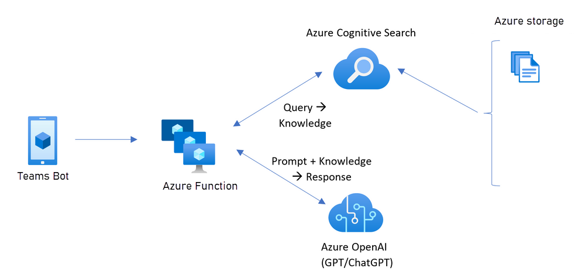
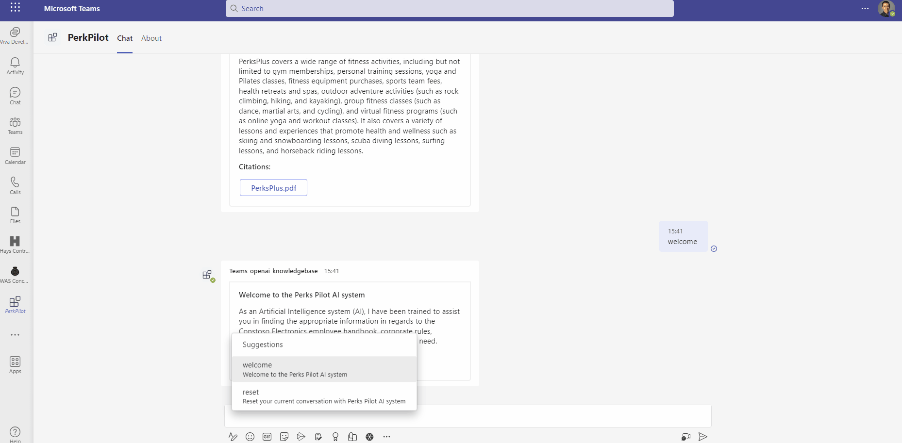
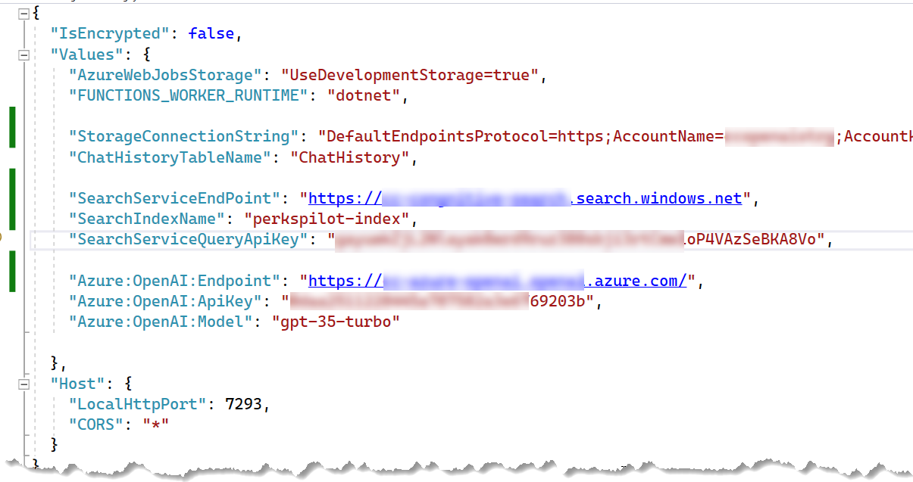
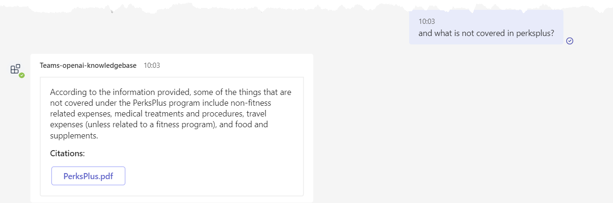

# Microsoft Teams Bot (PerksPilot) +  ChatGPT + Enterprise data with Azure OpenAI and Cognitive Search

This sample demonstrates a approach for creating ChatGPT-like experience over your own data using Microsoft Teams bot application. It uses Azure OpenAI Service to access the ChatGPT model (gpt-35-turbo), and Azure Cognitive Search for data indexing and retrieval.

The repo includes sample data so it's ready to try end to end. In this sample application we use a fictitious company called Contoso Electronics, and the experience allows its employees to ask questions about the benefits, internal policies, as well as job descriptions and roles.

## Features

* Chat and Q&A interfaces as Microsoft Teams Bot Application
* Responses with citation using Azure Open AI
* Integration of Azure congnitive search
* Azure storage container as backend data
* Azure function as backend app
* Azure table storage for maintaing previous chat history
  
 

## Getting Started

> **IMPORTANT:** In order to deploy and run this example, you'll need an **Azure subscription with access enabled for the Azure OpenAI service**. You can request access [here](https://aka.ms/oaiapply). You can also visit [here](https://azure.microsoft.com/free/cognitive-search/) to get some free Azure credits to get you started.

## Prerequisites

- [Node.js](https://nodejs.org/), supported versions: 16, 18
- An M365 account. If you do not have M365 account, apply one from [M365 developer program](https://developer.microsoft.com/en-us/microsoft-365/dev-program)
- [Teams Toolkit Visual Studio Code Extension](https://aka.ms/teams-toolkit) version 5.0.0 and higher or [TeamsFx CLI](https://aka.ms/teamsfx-cli)

- Create a storage account and upload sample data from this repo to Azure storage
- Create Azure cognitive search service and load sample data from above Azure storage into cognitive search. 
- Navigate to <mark>api folder</mark> and open the Azure function in the visual studo and update the **local.settings.json** with the following parameters

 

## Debug Azure function

- Navigate to <mark>api folder and open the Azure function project within Visual Studio</mark> 
- From Visual Studio: Start debugging the project by hitting the `F5` key.
- Make sure the Azure function project is up and running in debug mode

## Debug Teams Bot app

- From Visual Studio Code: Start debugging the project by hitting the `F5` key in Visual Studio Code.
- Alternatively use the `Run and Debug Activity Panel` in Visual Studio Code and click the `Run and Debug` green arrow button.
- Install the PerksPilot Teams bot app locally
- Here you can ask question from Perks Pilot bot from your own data which available within the Azure cognitive search index

For example

 
